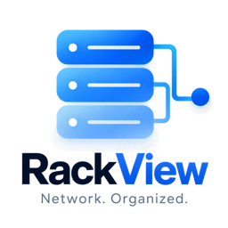
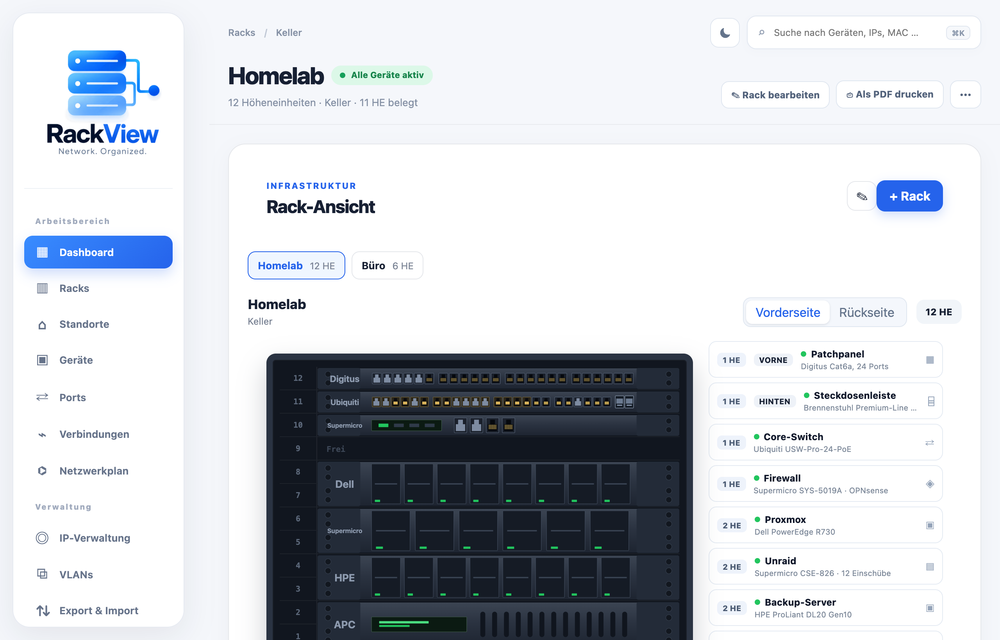
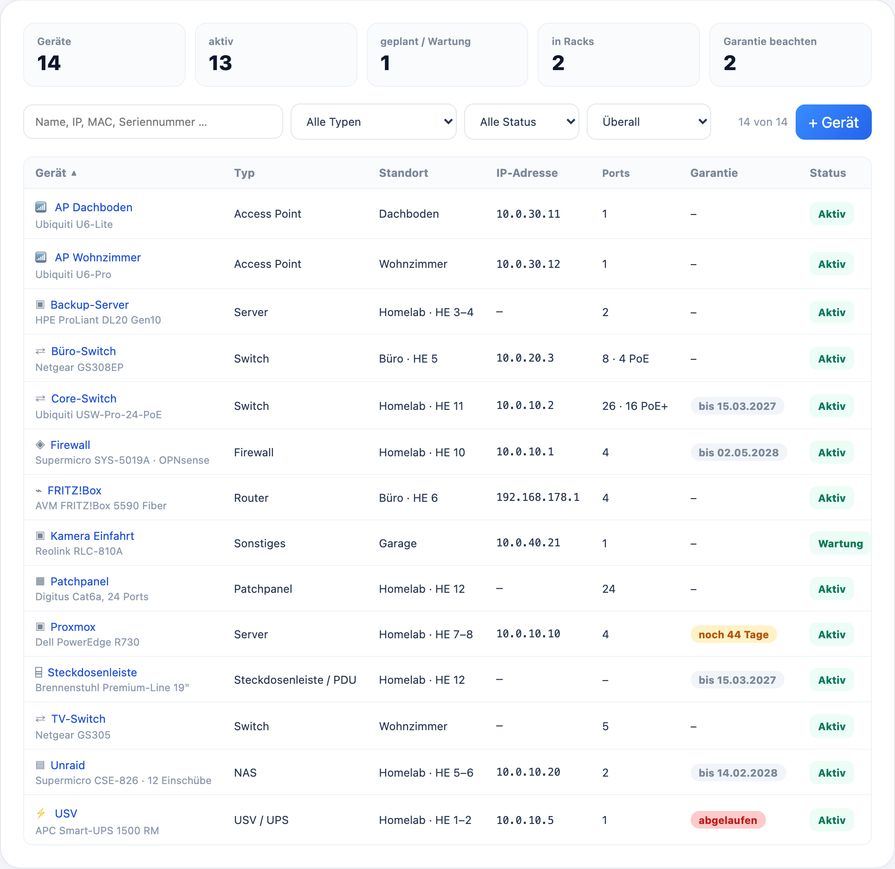
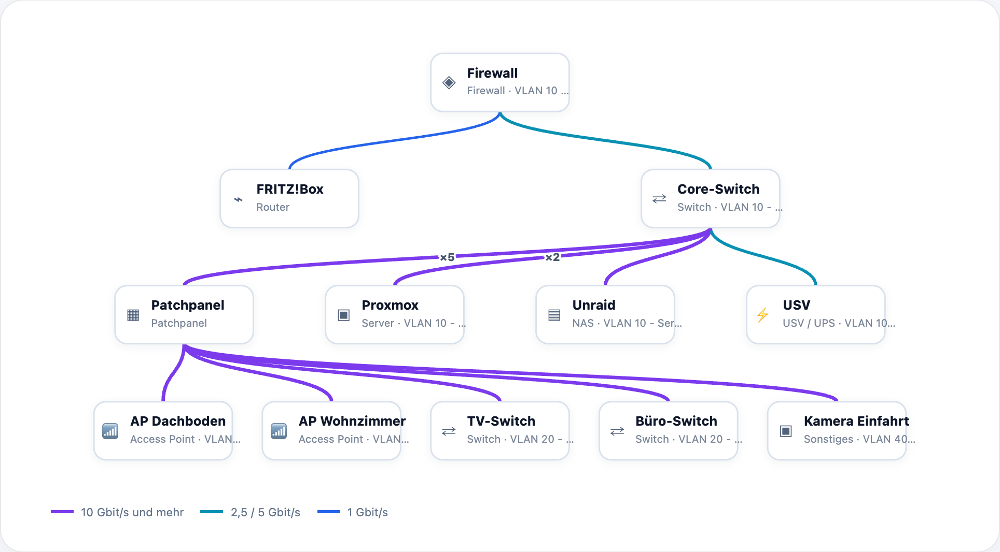
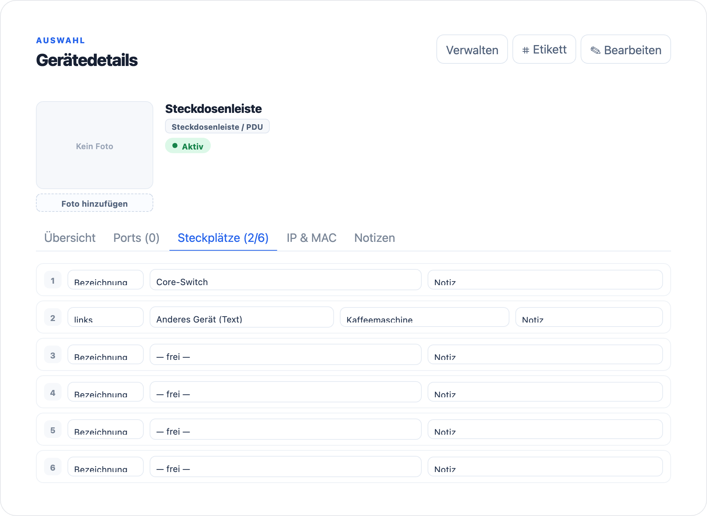
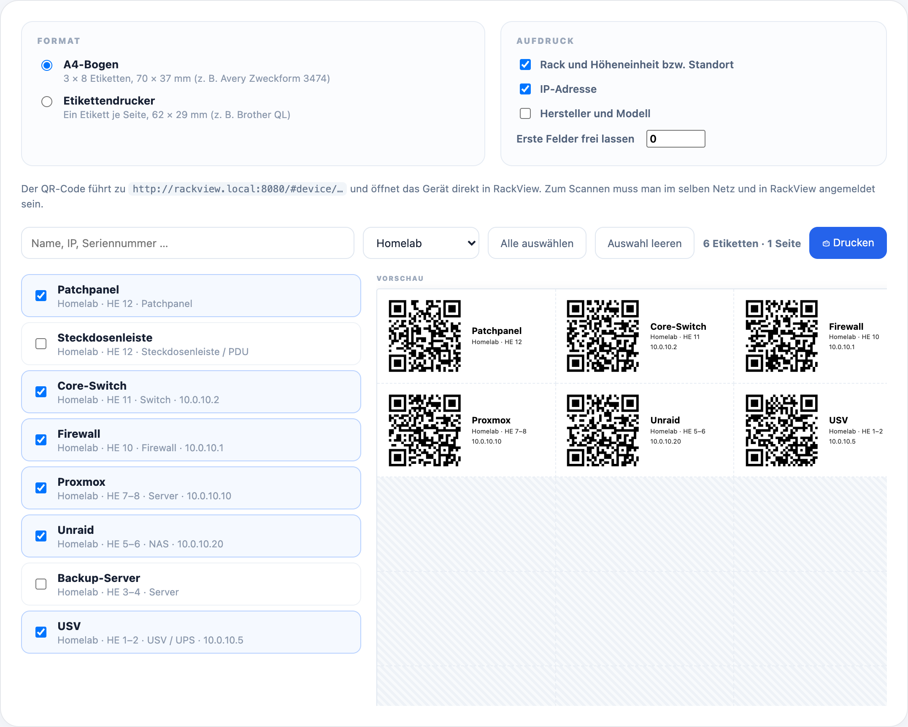

<p align="center">
  
</p>

<p align="center">
  <b>Dokumentation für Serverschrank und Heimnetz – selbst gehostet, in einem Container.</b>
</p>

<p align="center">
  <a href="https://github.com/alexanderschubert/rackview/actions/workflows/image.yml"></a>
  <a href="LICENSE"></a>
  <a href="https://alexanderschubert.github.io/rackview/"></a>
</p>

> **English:** RackView documents server racks and home networks: devices in rack
> units with front and rear view, ports and cable connections, network map, IPs and
> VLANs, power outlets, warranty dates and QR labels. It ships as a single Docker
> image with a built-in PostgreSQL database. The user interface is currently
> **German only**. Quick start: see *Installation* below – the commands are the same
> in any language. Built by Alexander Schubert with the help of Claude, an AI
> assistant – see *Über das Projekt*.



## Funktionen

- **Racks** mit Vorder- und Rückansicht, beliebiger Höhe und Geräten, die nur vorne
  oder nur hinten sitzen – etwa Patchpanel vorne, Steckdosenleiste hinten
- **Gerätefronten**, die aussehen wie das Gerät: RJ45- und SFP-Buchsen, belegte Ports
  farbig, Steckdosenleisten mit ihren Schukodosen
- **Standorte** für alles, was nicht im Rack steht: Access Points, Modem, Kameras
- **Ports und Verbindungen** zwischen Geräten, mit Kabeltyp und Länge, PoE je Port
- **Netzwerkplan**, der sich aus den Verbindungen selbst zeichnet
- **IP-Adressen und VLANs** mit Übersicht, wer welche Adresse belegt
- **Steckplätze** an Steckdosenleiste und USV: welches Gerät hängt wo
- **Kaufdatum und Garantie** mit Warnung, bevor die Garantie ausläuft
- **QR-Etiketten** für A4-Bögen oder Etikettendrucker – Scannen öffnet das Gerät
- **Export** als CSV, PDF und JSON – die JSON-Datei ist eine vollständige Sicherung
  und lässt sich wieder einlesen
- **Konten** mit getrennten Bereichen, Zwei-Faktor-Anmeldung und optional
  Anmeldung über Authentik oder einen anderen OIDC-Anbieter
- **Helle und dunkle Ansicht**
- **Nächtliche Sicherung** der Datenbank

<table>
  <tr>
    <td></td>
    <td></td>
  </tr>
  <tr>
    <td></td>
    <td></td>
  </tr>
</table>

## Installation

Im Image steckt alles: Oberfläche, Schnittstelle und PostgreSQL. Ein Port, ein
Datenpfad – mehr braucht es nicht.

### Unraid

RackView steht im App-Katalog: **Apps** → nach **RackView** suchen → **Install**.
Port und Datenpfad prüfen, **Apply**.

> **Bald verfügbar:** RackView ist für den App-Katalog freigegeben und erscheint dort
> mit dessen nächster Aktualisierung. Findest du es noch nicht, nimm so lange den Weg
> über die Vorlage.

Ohne App-Katalog geht es über die Vorlage (Konsole von Unraid, oben rechts `>_`):

```bash
wget -O /boot/config/plugins/dockerMan/templates-user/my-RackView.xml \
  https://raw.githubusercontent.com/alexanderschubert/rackview/main/templates/rackview.xml
```

Dann **Docker → Add Container**, oben unter *User templates* **RackView** wählen.
Ausführlich, mit Updates und Fehlersuche: [unraid/README.md](unraid/README.md)

### Docker

```bash
docker run -d --name rackview \
  --restart unless-stopped \
  -p 8080:80 \
  -v /pfad/zu/rackview:/config \
  -e TZ=Europe/Berlin \
  ghcr.io/alexanderschubert/rackview:latest
```

### Docker Compose

```yaml
services:
  rackview:
    image: ghcr.io/alexanderschubert/rackview:latest
    container_name: rackview
    restart: unless-stopped
    ports:
      - "8080:80"
    volumes:
      - ./rackview:/config
    environment:
      TZ: Europe/Berlin
```

### Erster Start

Der erste Start dauert etwas länger – die Datenbank wird angelegt. Danach
`http://<server>:8080` aufrufen und ein Konto anlegen. **Das erste Konto wird
Administrator.**

Ist RackView aus dem Internet erreichbar, danach die Selbstregistrierung abschalten
(`RACKVIEW_REGISTRATION=false`). Weitere Konten legt der Administrator dann in den
Einstellungen an.

## Was im Datenpfad liegt

```
/config/db              Datenbank (PostgreSQL)
/config/uploads         hochgeladene Gerätebilder
/config/backups         nächtliche Sicherungen der Datenbank
/config/app.key         Anwendungsschlüssel
/config/db-passwort     Passwort der eingebauten Datenbank
```

> **`app.key` gut aufheben.** Mit ihm sind die Zwei-Faktor-Geheimnisse
> verschlüsselt. Wer den Datenpfad sichert, hat ihn automatisch dabei.

## Updates

```bash
docker pull ghcr.io/alexanderschubert/rackview:latest
docker rm -f rackview   # danach den run-Befehl von oben erneut ausführen
```

Mit Compose: `docker compose pull && docker compose up -d`. Auf Unraid genügt
**Check for Updates** in der Docker-Übersicht.

Die Datenbank wird beim Start automatisch angepasst, die Daten im Datenpfad bleiben
unberührt. Wer eine bestimmte Fassung festhalten will, nimmt statt `latest` eine
Versionsnummer, etwa `ghcr.io/alexanderschubert/rackview:1.0.0` – alle Fassungen
stehen unter [Packages](https://github.com/alexanderschubert/rackview/pkgs/container/rackview).

## Einstellungen

Alle Einstellungen sind Umgebungsvariablen und optional. Die wichtigsten:

| Variable | Standard | Bedeutung |
| --- | --- | --- |
| `TZ` | `Europe/Berlin` | Zeitzone für Protokolle und Sicherung |
| `RACKVIEW_REGISTRATION` | `true` | Selbstregistrierung auf der Anmeldeseite |
| `APP_URL` | – | nur hinter einem Reverse-Proxy nötig, z. B. `https://rack.example.de` |
| `BACKUP_SCHEDULE` | `0 3 * * *` | Zeitpunkt der Sicherung (Cron); leer schaltet sie ab |
| `RETENTION_DAYS` | `14` | Aufbewahrung der Sicherungen in Tagen |
| `DB_HOST` | – | leer = eingebaute Datenbank; gesetzt = eigene PostgreSQL-Datenbank |
| `OIDC_ENABLED` | `false` | Anmeldung über Authentik o. ä. freischalten |

Die vollständige Liste, externe Datenbank und die Einrichtung von OIDC stehen in
[unraid/README.md](unraid/README.md#anhang-alle-einstellungen) – sie gelten für
jede Docker-Installation, nicht nur für Unraid.

## Hilfe und Mitmachen

- **Fehler gefunden oder eine Idee?** Gern als
  [Issue](https://github.com/alexanderschubert/rackview/issues).
- **Sicherheitslücke?** Bitte nicht als öffentliches Issue, sondern über
  [Security → Report a vulnerability](https://github.com/alexanderschubert/rackview/security/advisories/new).
- **Selbst bauen und entwickeln:** [ENTWICKLUNG.md](ENTWICKLUNG.md)

Gebaut mit Laravel, Vue 3 und PostgreSQL.

## Über das Projekt

RackView ist aus meinem eigenen Homelab entstanden. Ideen, Aufbau und Entscheidungen
stammen von mir, getestet wird im eigenen Rack auf Unraid. Den Code schreibe ich zum
großen Teil zusammen mit [Claude](https://claude.ai), einem KI-Assistenten von
Anthropic – deshalb steht Claude in den Commits als Co-Autor.

## Lizenz

[MIT](LICENSE)
